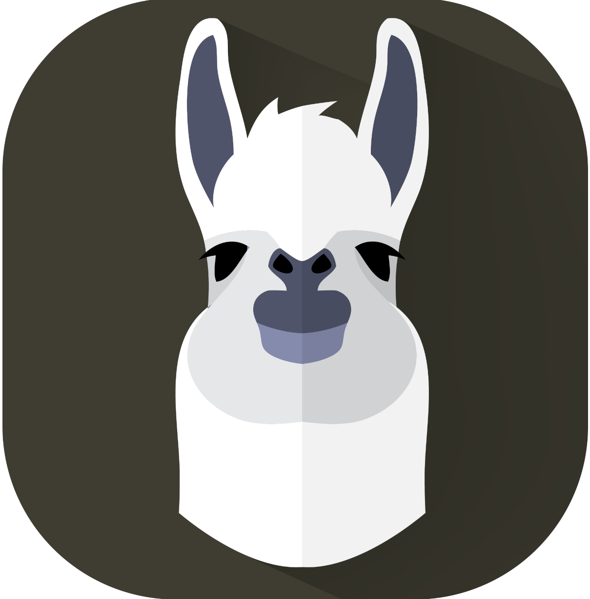

# Alpaca



**Alpaca** is a user-friendly desktop application and web chat interface built on top of [llama.cpp](https://github.com/ggml-org/llama.cpp), bringing the power of local LLM inference to everyday users through an intuitive, Ollama-like experience — with integrated **Bonsai ternary and image model** support.

## What is Alpaca?

This project expands `llama.cpp` beyond its server and command-line roots into a **complete desktop application** with a modern chat interface, model management, and extensible tooling — all running **fully locally** on your hardware.

No cloud APIs. No data leaving your machine. Just download a model and start chatting.

This fork (alpaca-bonsai) integrates the [bonsai-beach](https://github.com/bonsai/bonsai-beach) model catalog and backend configuration so the Bonsai ternary (27B/8B), image (4B), TTS, and STT models work out of the box.

## Overview

Alpaca brings together:

- **llama.cpp inference engine** — Automatically downloads the correct GPU/CPU backend binaries from [PrismML-Eng/llama.cpp releases](https://github.com/PrismML-Eng/llama.cpp/releases) (ternary kernel support).
- **Bonsai ternary models** — Bonsai 27B (chat + vision) and Bonsai 8B (chat) pre-checked by default in onboarding.
- **Image generation** — Local image generation via sd.cpp (leejet/stable-diffusion.cpp) and the Bonsai Image 4B model. Dedicated `/image` route and inline `/imagine` chat command.
- **Voice Service (STT/TTS)** — Speech-to-text via local whisper.cpp with a microphone button; text-to-speech via OuteTTS using bonsai-beach model URLs.
- **Modern SvelteKit WebUI** — Chat interface, model management, image generation, and settings.
- **Multi-Model Chat** — Run multiple models simultaneously in either Comparison mode (side-by-side answers) or Parallel mode (independent conversation threads per model).
- **System tray integration** — Runs in the background; restore from tray.
- **OpenAI-compatible API** — Exposes `http://127.0.0.1:13434/v1` for IDE integrations and third-party tools.
- **Interactive API Explorer** — Built-in Swagger UI for exploring the REST API.
- **Bundled Documentation** — Docusaurus docs site with guides, API reference, and troubleshooting.
- **HuggingFace model service** — Curated model list + search any GGUF repo.
- **Terminal UI** — Rust-based `alpaca-tui` (bonsai-beach-tui compatible) for terminal users.
- **Agent integrations** — Per-agent setup guides for Claude Code, Codex, VS Code, and more (see `config/agents/`).

## Project Structure

```
alpaca-bonsai/
├── desktop/          # Electron main process, system tray, backend manager
│   ├── main.js       # Main entry point (hardware detection, server, tray, IPC)
│   ├── preload.js    # Secure renderer bridge
│   ├── binary-manager.js    # Auto-download llama.cpp / sd.cpp / whisper.cpp backends
│   ├── bonsai-models.js     # Bonsai model catalog (27B, 8B, image, TTS, STT)
│   ├── image-service.js     # Local image generation via sd.cpp
│   ├── voice-service.js     # Local STT (whisper.cpp) and TTS (OuteTTS)
│   ├── api-server.js        # Configurable OpenAI-compatible API endpoint
│   └── package.json         # Electron builder config
├── webui/            # SvelteKit chat interface
├── tui/              # Rust terminal UI (alpaca-tui)
├── docs/             # Docusaurus documentation site
├── bots/             # Discord and Slack bot integrations
├── config/agents/    # Per-agent setup guides (Claude Code, Codex, etc.)
└── media/            # App icons and branding assets
```

## Build Commands

```powershell
# 1. Install JS dependencies
npm install
cd webui && npm install
cd ../desktop && npm install
cd ../docs && npm install

# 2. Dev mode
cd webui && npm run dev          # SvelteKit dev server
cd desktop && npm start          # Electron shell
cd docs && npm run start         # Docusaurus docs

# 3. Build
npm run build                    # Build webui + docs + desktop
npm run build:windows            # Windows installer + portable
npm run build:mac                # macOS DMG + PKG
npm run build:linux              # Linux AppImage + DEB + RPM + snap
npm run build:tui                # Rust terminal UI (requires cargo)
```

## Desktop Feature Set

- **Chat UI:** Streaming, markdown, syntax highlighting, attachments, MCP, branching, inline `/imagine` image generation
- **Image Generation:** Dedicated `/image` route with prompt, steps, CFG, sampler, seed controls and gallery
- **Model Management:** Built-in Bonsai catalog, HuggingFace download with resume, SHA-256 verification
- **Knowledge Base:** RAG with document collections, web search, MCP integration
- **Workspace:** Local project folder selection, file tree browsing, IDE config generation
- **Integrations:** Auto-configure 25+ third-party tools for local API endpoint
- **Settings:** Comprehensive modal with all provider/config tabs
- **API Server:** OpenAI-compatible standalone server on port 13434
- **Voice:** STT via whisper.cpp, TTS via OuteTTS
- **Secret Vault:** Encrypted credential storage with key derivation
- **Scheduler:** Background model lifecycle management
- **VRAM Budget Manager:** GPU memory allocation and optimization
- **Binary Manager:** Auto-download correct llama.cpp / sd.cpp / whisper.cpp backend binaries
- **Splash Manager:** Animated splash screen with progress updates
- **Lazy-Start Manager:** On-demand backend activation

## License

MIT OR Apache-2.0
